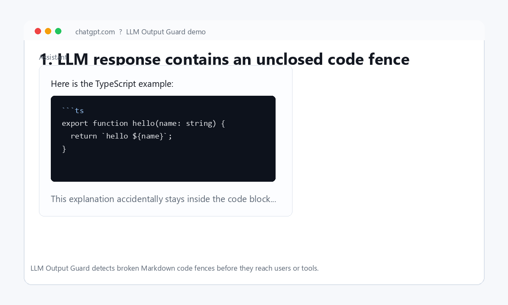
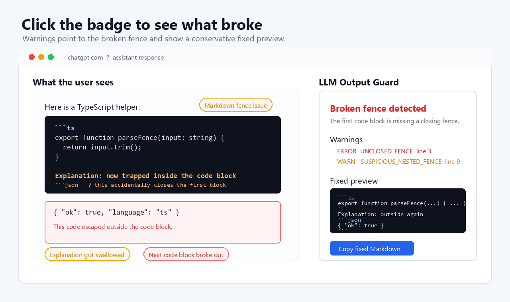

# LLM Output Guard

LLM Output Guard detects and fixes broken Markdown code fences in ChatGPT, Claude, Gemini, and MCP-based coding agents.

[한국어 README](./README.ko.md)



## Why

I got tired of LLMs breaking their own Markdown code fences, so I built a guard for it.

Even LLMs explaining Markdown fences can break Markdown fences. A single missing closing fence can swallow the rest of a response into a code block, confuse users, and break downstream tools.

LLM Output Guard catches those structural Markdown failures before the output reaches a user, a file, a pull request, or another agent.

## What It Catches

- unclosed code fences
- malformed short backtick fences
- missing language tags
- suspicious nested fences inside open code blocks
- explanations accidentally rendered inside code blocks

Everything runs locally. No AI APIs, no tracking, no code execution.

## Before / After

Before:

<pre><code>Here is the TypeScript example:

&#96;&#96;&#96;ts
export function parseFence(input: string) {
  return input.trim();
}

Explanation: this should be normal text.

&#96;&#96;&#96;json
{ "ok": true }
&#96;&#96;&#96;

But the explanation got swallowed by the first code block,
and the JSON block may render in the wrong place.</code></pre>

After:

<pre><code>Here is the TypeScript example:

&#96;&#96;&#96;ts
export function parseFence(input: string) {
  return input.trim();
}
&#96;&#96;&#96;

Explanation: this is normal text again.

&#96;&#96;&#96;json
{ "ok": true }
&#96;&#96;&#96;</code></pre>

## Chrome Extension

The Chrome extension watches assistant responses in ChatGPT, Claude, and Gemini. When it finds broken or suspicious Markdown fences, it adds a small warning badge. Clicking the badge opens a fixed Markdown preview with warnings and a copy button.



Build and load it locally:

```bash
pnpm install
pnpm --filter @llm-output-guard/browser-extension build
```

Then open `chrome://extensions`, enable `Developer mode`, click `Load unpacked`, and select `packages/browser-extension`.

Prepare the Chrome Web Store upload package:

```bash
pnpm --filter @llm-output-guard/browser-extension package
```

The upload ZIP is created at `packages/browser-extension/release/llm-output-guard-chrome-0.1.0.zip`.
Store listing copy and privacy text live in [docs/chrome-web-store/listing.md](./docs/chrome-web-store/listing.md).

Supported sites:

- `https://chatgpt.com/*`
- `https://chat.openai.com/*`
- `https://claude.ai/*`
- `https://gemini.google.com/*`

## MCP Server

Use the MCP server when you want coding agents to validate their Markdown before showing it to users or applying it to files.

```bash
pnpm install
pnpm build
pnpm --filter @llm-output-guard/mcp-server start
```

Example MCP client config:

```json
{
  "mcpServers": {
    "llm-output-guard": {
      "command": "pnpm",
      "args": [
        "--dir",
        "/path/to/llm-output-guard",
        "--filter",
        "@llm-output-guard/mcp-server",
        "start"
      ]
    }
  }
}
```

Tools:

- `validate_markdown_output`: validate Markdown output and return warnings plus stats
- `fix_markdown_output`: conservatively append a missing closing fence and return remaining warnings

## CLI

Check a Markdown file:

```bash
pnpm guard check ./example.md
```

Print a fixed version:

```bash
pnpm guard fix ./example.md
```

Write the fix back to the file:

```bash
pnpm guard fix ./example.md --write
```

## TypeScript Library

~~~ts
import { fixMarkdownFences, validateMarkdownFences } from "@llm-output-guard/core";

const text = "```ts\nconst value = 1;";
const result = validateMarkdownFences(text);

if (!result.ok) {
  const fix = fixMarkdownFences(text);
  console.log(fix.fixedText);
}
~~~

## Architecture

```text
packages/core
  Shared Markdown fence validator and fixer

packages/cli
  Local file checker

packages/mcp-server
  MCP tools for IDE agents

packages/browser-extension
  Chrome extension for ChatGPT, Claude, and Gemini web UIs
```

## Warning Types

| Type | Severity | Meaning |
| --- | --- | --- |
| `UNCLOSED_FENCE` | `error` | A code block was opened but not closed before EOF |
| `MALFORMED_FENCE` | `warning` | A one- or two-backtick line looks like an intended fence |
| `MISSING_LANGUAGE` | `warning` | An opening fence has no language tag |
| `SUSPICIOUS_NESTED_FENCE` | `warning` | Triple backticks appeared inside an open block without forming a valid close |

## Development

```bash
pnpm install
pnpm test
pnpm check
pnpm build
```

## Manual Extension Test

1. Run `pnpm --filter @llm-output-guard/browser-extension build`.
2. Load `packages/browser-extension` as an unpacked Chrome extension.
3. Open ChatGPT.
4. Ask it to produce intentionally broken Markdown fence output.
5. Confirm the `Markdown fence issue` badge appears.
6. Click the badge and confirm the fixed preview panel appears.
7. Click `Copy fixed Markdown`.

## Roadmap

- JSON block validation
- XML/HTML tag validation
- VS Code extension
- GitHub Actions integration
- streaming validation for partial LLM responses

## License

MIT
